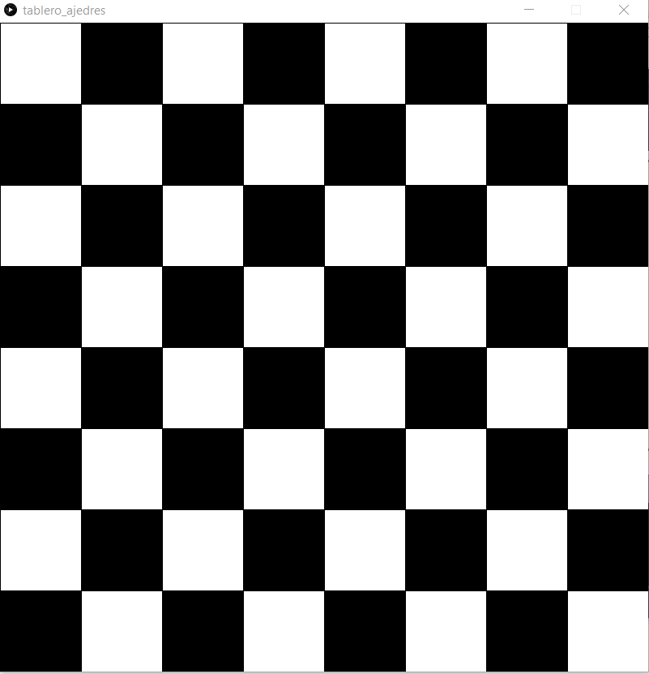
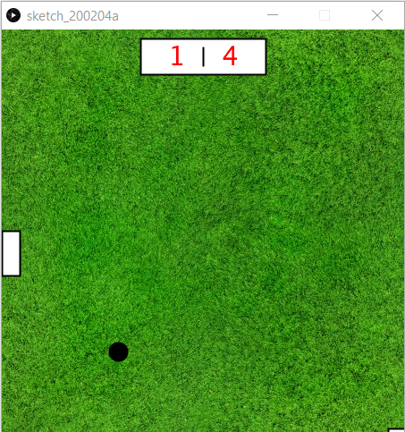
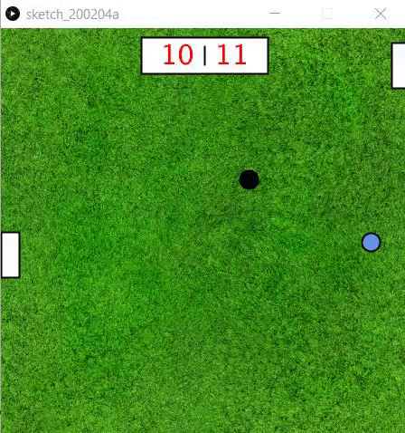

# PONG_processing3
Practica 1 de CIU
# CIU - Práctica 1
# Rubén García Quintana

## Programando el juego Pong con processing 

La primera práctica de la asignatura consiste en realizar una juego clasico usando processing3. El juego consiste en dos jugadores enfrentados entre ellos y debe evitar que una pelota llegue a la pared tras ellos.

Aqui podemos ver un gif con una pequeña demostración de su ejecución. Aunque quitando algunos extras que no se encuentran estables del todo.


### Desarrollo de la práctica

Para la realización de esta práctica primero empezamos probando un poco el manejo de las coordenadas creando algunos obejtos, por ejemplo, un tablero de ajedrez.




Cuando ya estabamos más preparados y se nos habia presentado distintas herramientas de processing comenzamos a desallorrar nuestro pequeño juego.


#### La Pelota

- Primero empezamos a desarrollar una pelota que se mantuviera dentro de nuestro marco de trabajo. Esto fué sencillo mediante el siguiente código:

```
background(img1)
.
.
.
x=x+vx;
  
ellipse(x,y,20,20);

.
.
.

      if(x<0 || x>width){
        vx=-vx;
      }
      y=y+vy;
      if(y>height || y<0){
        vy=-vy;
      }
```

Con este código conseguimos tanto el movimiento de la pelota como evitar que se salga de los limites de nuestra ventana.

#### Los jugadores

- Para los jugadores se realizó algo bastante parecido. Primero, para facilitar posibles modificaciones futuras, por ejemplo añadir hasta 4 jugadores, se creó una clase jugador. Ducha clase serviría para manejar los distintos atributos de los jugadore.

```
class jugador{
      public int[] coord= new int[2];
      public int score;
      jugador(int a, int b){
          coord[0]=a;
          coord[1]=b;
          score=0;
      }
      

      public boolean win(){
        score++;
        sound5.trigger();
        if(score>=max2)return true;
        return false;
      }
      public void subir(){
        if(coord[1]>0)coord[1]=coord[1]-10;
      }
      public void bajar(){
        if(coord[1]<=height-50)coord[1]=coord[1]+10;
      }
      public int[] get(){
        return coord;
      }
      public int getScore(){
          return score;
      }
      
      public void resetScore(){
        score=0;
      }
      
  }
```

-Apoyandonos en esta clase, declaramos los dos rectangulos que serán los jugadores de nuestro juego.
```
    rect(jug2.get()[0],jug2.get()[1],20,50);
    rect(jug1.get()[0],mouseY,20,50);
```

-Para este juego necesitamos que los jugadores tambien provoquen la modificación de la posición de la bola, esto lo conseguimos del siguinete modo:


- Para el jugador de la derecha, que es manejado con el raton.
```
if( vx>0 && mouseY+50 > y && mouseY <= y+20 && x+10 >= jug1.get()[0] && jug1.get()[0]+10 > x  ){
            sound2.mute();
            sound3.trigger();
            sound2.unmute();
            vx=-vx;
            vy= (int) random(-5,5);          
      }
```


- Para el jugador de la izquierda que es movido con las teclas 'w', para subir, y 's' para bajar.
```
if( vx<0 && x+20 >=jug2.get()[0] && jug2.get()[0]+20 > x && jug2.get()[1] <= y+20 && jug2.get()[1]+50 > y ){
          sound2.mute();
          sound3.trigger();
          sound2.unmute();
          vx=-vx;
          vy= (int) random(-5,5);
      }
```


- Este movimiento del jugador dos se encuentra desarrollado utilizando el metodo keyPressed:

```
    if(keyPressed){
      if(key=='w')jug2.subir();
      if(key=='s')jug2.bajar();
    }
```


De este modo ya tendríamos todo lo básico del juego, una pelota que se desplaza y dos jugadores que pueden interactuar con ella.


#### La puntuación

- Para generar una puntuación para cada jugador necesitamos detectar cuando chocan la bola contra la pared defendidad por cada jugador. Esto es muy sencillo de realizar ya que sabemos que el limite lo marca el propio ancho de nuestra ventana. En nuestro caso, nos ayudamos de la clase jugador para llevar el recuento de la puntuación propia y, en caso de que se llegue a la puntuación acordada como máxima, se acabe el juego.

```
    if(x>=width)if(jug2.win())end(2) ;
    if(x<=0)if(jug1.win())end(1);

```
Como vemos también aprovechamos para comunicar que jugador ha ganado, ya sea el  o el 2.


```
public boolean win(){
        score++;
        sound5.trigger();
        if(score>=max2)return true;
        return false;
      }
```


- Metodo para finalizar el uego y poder empezar otro.
```
void end(int n){
   game=false;
   sound2.stop();
   sound4.trigger();
   jug1.resetScore();
   jug2.resetScore();
   ganador=n;
   music=true;
   sound.trigger();

 }
```


#### El sonido

- Como habrán observado en partes del codigo anterior, también se ha utilizado la biblioteca Minim para producir sonidos en mp3 en ciertos casos, por ejemplo, durante la partida, al puntuar, al rebotar la pelota en un jugador, etc.

```
import ddf.minim.*;

  Minim sonido;
  AudioSample sound;
  AudioSample sound2;
  AudioSample sound3;
  AudioSample sound4;
  AudioSample sound5;
  
.  
.
.

  sound= sonido.loadSample("main.mp3",1024);
  sound3= sonido.loadSample("golpe.mp3",1024);
  sound4= sonido.loadSample("win.mp3",1024);
  sound5= sonido.loadSample("point.mp3",1024);
  sound.trigger();
  
  ```
  
Con esto, ya tendriamos lo esencial exigido en la práctica.


#### Los extras

- Por último, como se puede apreciar en el gif inicial, se han añadido algunas funcionalidad extras.
 
 
##Selector de puntuación máxima.

Al ejecutar la aplicación lo primero que veremos será un pequeño menu donde podremos o bien jugar de inmediato pulsando "enter" o bien, indicar por teclado cual queremos que sea la puntuación que decida la victoria. Para esto sencillamente leemos por teclado la entrada de datos del usuario con el metodo keyPressed y filtramos segun las opciones.

```
void keyPressed(){
    if(key==ENTER)game=true;
    if(Character.isDigit(key)){
      max= max+key;
    }
    if(key==BACKSPACE && max.length()>0){
    max=max.substring(0,max.length()-1);
    }
  }
  
```

Para mostrar la ventana de menu y no iniciar el juego directamente solo usamos una variable booleana en el metodo draw para elegir el camino a ejecutar.

## Además también se ha incluido un marcador que los jugadores conozcan la situación de la partida en cada momento.



## Bonificadores

- Por ultimo se ha creado un modificador que consiste en una bola azul que aparece cada cierto tiempo en la pantalla de juego. Si la pelota principal golpea esta bola, la pelota se movera mas rápido durante un cierto periodo de tiempo. Esta parte se encuentra comentada en el codigo ya que actualmente no termina de ser estable y puede llegar a suceder algun fallo. Si se quiere activar tan solo se debe descomentar estas partes del codigo. 

```

/*fill(100,149,237);
    if(bonusplus)ellipse(rand1,rand2,20,20);
    fill(255);*/
    
    
 .
 .
 .
 
 
/*AUMENTO DE VELOCIDAD*/
      /*if(rand1 !=0 && rand2 != 0 && ( ( abs(x-rand1)<20 ) && ( abs(y-rand2)<20 ) ) ){
        vx=vx*1.25;
        bonus=601;
        count=7000;
        bonus=0;
        bonusplus=false;
        rand1=0;
        rand2=0;
        
      }
      
      if(count>0){
        count--;
        if(count==0){
          vx=vx*0.8;
        }
      }*/
      
 ```
 
 
 

      
      
      
      
